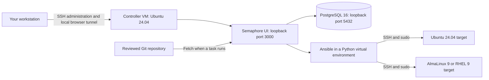

# Ansible + Semaphore: build, understand and operate a small lab

A general, self-contained guide to building a native Ansible and Semaphore UI
controller, managing Ubuntu and Enterprise Linux targets, and learning how to
verify and recover your automation.

**Start with one manual walkthrough, then automate repeatable work.** You will
run the same playbooks from the terminal and from Semaphore, inspect the
results, repair deliberate drift, and practice recovery.

This repository contains example configuration and code. It contains **no
working credentials, private inventories, cloud account identifiers, database
dumps or deployment-specific recovery material**. Replace `*.example.test`
hostnames with your own addresses and generate credentials locally.

## What you will build



The controller runs on a dedicated VM. Ansible connects to the targets over
SSH; the targets do not need an Ansible agent. Semaphore supplies the web
interface, credentials, job configuration and task history. It runs Ansible;
it does not replace the playbooks.

## Read in this order

| Step | Guide | Result |
| --- | --- | --- |
| 1 | [Design and prerequisites](docs/01-design.md) | Choose resources, networks and account boundaries. |
| 2 | [Create the VMs](docs/02-create-vms.md) | Build a controller and two fresh targets. |
| 3 | [Install the controller](docs/03-controller.md) | Install natively, manually or with the reviewed installer. |
| 3b | [Enterprise Linux 9 seeded controller](docs/03-controller-el9.md) | Alternative: one run installs and seeds a local-folder practice project on RHEL, Alma or Rocky 9. |
| 4 | [SSH, sudo and target bootstrap](docs/04-access.md) | Establish verified, key-based automation access. |
| 5 | [Command-line Ansible lessons](docs/05-cli-lessons.md) | Preview, apply, repeat and inspect five playbooks. |
| 6 | [Configure Semaphore](docs/06-semaphore.md) | Run the same lessons from named task templates. |
| 7 | [Git and VS Code](docs/07-git-and-vscode.md) | Edit, review and deliberately deliver changes. |
| 8 | [Patching and daily operations](docs/08-operations.md) | Handle maintenance, reboots, drift and failures. |
| 9 | [Optional CIS/STIG practice](docs/09-security-benchmarks.md) | Assess a specific vendor baseline and interpret findings. |
| 10 | [Backup, restore and rebuild](docs/10-recovery.md) | Protect configuration, encrypted credentials and data. |
| 11 | [Troubleshooting](docs/11-troubleshooting.md) | Diagnose failures by layer. |
| 12 | [Learning exercises and RHCE alignment](docs/12-learning-path.md) | Progress toward independently written automation. |
| Optional | [Azure and cloud-init](docs/13-azure.md) | Extend the same SSH bootstrap model to cloud VMs. |

Each main walkthrough uses **Goal → Do → Check → Concept**. Commands identify
whether they run on your workstation, controller or target. Finish a check
before proceeding to the next layer.

## Included runnable examples

| File | What it does |
| --- | --- |
| [`playbooks/ping.yml`](playbooks/ping.yml) | Checks SSH/Python and identifies the target OS. |
| [`playbooks/baseline.yml`](playbooks/baseline.yml) | Manages a login banner and the time service. |
| [`playbooks/users.yml`](playbooks/users.yml) | Creates reserved, ordinary practice accounts. |
| [`playbooks/webserver.yml`](playbooks/webserver.yml) | Deploys a templated nginx page on target loopback port 8080. |
| [`playbooks/patch.yml`](playbooks/patch.yml) | Updates one target at a time; reboot defaults to disabled. |
| [`scripts/install-controller.sh`](scripts/install-controller.sh) | Shows a plan by default; `--apply` bootstraps a fresh Ubuntu controller. |
| [`scripts/install-controller-el9.sh`](scripts/install-controller-el9.sh) | Same contract for RHEL, AlmaLinux or Rocky 9; also seeds a local-folder practice project through the API. |
| [`scripts/seed-semaphore.py`](scripts/seed-semaphore.py) | Creates the practice project, keys, local repository, file inventory and templates on loopback; prints names and ids only. |
| [`scripts/add-target.sh`](scripts/add-target.sh) | Adds a host to the local inventory only when its scanned host key matches the fingerprint you read from its console. |
| [`scripts/check-controller.py`](scripts/check-controller.py) | Checks controller services, permissions and loopback listeners without printing credentials. |
| [`scripts/validate.py`](scripts/validate.py) | Checks repository links, examples and publication boundaries locally. |

All lesson playbooks require an explicit `--limit`. The nginx lesson owns its
target's entire nginx configuration; use a disposable target where it cannot
replace an application you need. The users lesson owns only reserved `lab_`
accounts. Read each playbook before running it.

## Version baseline

| Component | Guide baseline |
| --- | --- |
| Native controller | Ubuntu Server 24.04 LTS, amd64; alternative Enterprise Linux 9 x86_64 path |
| Controller Python | 3.12 in the operating system; separate Ansible virtual environment |
| Ansible Core | 2.20.8 |
| Semaphore UI | Community 2.19.12, checksum-verified native binary |
| Database | PostgreSQL 16 from Ubuntu repositories or the EL9 `postgresql:16` module stream |
| Main practice targets | Ubuntu 24.04 and AlmaLinux 9 |
| Optional vendor target | Registered RHEL 9 |

These are reproducibility pins, not a claim that they are the newest releases.
Review release notes and rerun validation before upgrading. No container
runtime, Kubernetes cluster, domain controller or paid Semaphore feature is
required for the main walkthrough.

See [validation and limitations](docs/VALIDATION.md) for the distinction between
the previously exercised workflows and this generalized publication's checks.
This is a learning setup, not a high-availability production design or a claim
of compliance with a security standard.

## Quick orientation

On a new controller, get a copy of this repository:

```bash
git clone https://github.com/kevo099/ansible-semaphore-guide.git
cd ansible-semaphore-guide
bash scripts/install-controller.sh --plan
```

The plan makes no changes. Follow [the controller guide](docs/03-controller.md)
before using `--apply`. After target bootstrap, a first scoped test looks like:

```bash
cp inventories/lab.ini.example inventories/lab.ini
$EDITOR inventories/lab.ini
/opt/ansible-venv/bin/ansible-playbook playbooks/ping.yml \
  --limit lab-ubuntu --private-key ~/.ssh/ansible_lab
```

Your private inventory is ignored by Git. Secrets belong in a password manager,
protected local files, an approved secrets service or Semaphore's Key Store.
Even encrypted lab Vault files should stay in your own private repository for
these exercises.

## Reading further

[Official references](docs/REFERENCES.md) link to Ansible, Semaphore, PostgreSQL,
Ubuntu, Red Hat and platform documentation. The examples use their public
interfaces; vendor benchmark content is installed from its own distribution
channels rather than redistributed here.
