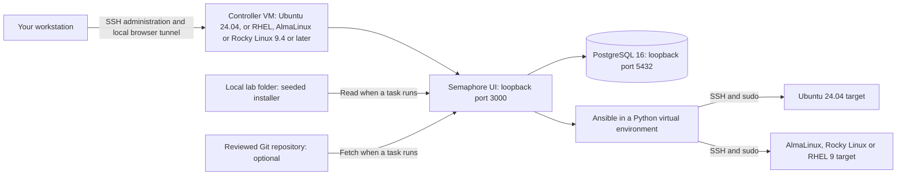

# Ansible + Semaphore: build, understand and operate a small lab

A general, self-contained guide to building a native Ansible and Semaphore UI
controller, managing Ubuntu and Enterprise Linux targets, and learning how to
verify and recover your automation.

**Start with one manual walkthrough, then automate repeatable work.** You will
run the same playbooks from the terminal and from Semaphore, inspect the
results, repair deliberate drift, and practice recovery.

This repository contains example configuration and code. It contains **no
working credentials, private inventories, cloud account identifiers, database
dumps or deployment-specific recovery material**. Replace `*.example.test`
hostnames with your own addresses and generate credentials locally.

## What you will build


```mermaid
flowchart LR
    W[Your workstation] -->|SSH administration and local browser tunnel| C[Controller VM: Ubuntu 24.04, or RHEL, AlmaLinux or Rocky Linux 9.4 or later]
    C --> S[Semaphore UI: loopback port 3000]
    S --> P[(PostgreSQL 16: loopback port 5432)]
    S --> A[Ansible in a Python virtual environment]
    L[Local lab folder: seeded installer] -->|Read when a task runs| S
    G[Reviewed Git repository: optional] -->|Fetch when a task runs| S
    A -->|SSH and sudo| U[Ubuntu 24.04 target]
    A -->|SSH and sudo| E[AlmaLinux, Rocky Linux or RHEL 9 target]
```

The controller runs on a dedicated VM. Ansible connects to the targets over
SSH; the targets do not need an Ansible agent. Semaphore supplies the web
interface, credentials, job configuration and task history. It runs Ansible;
it does not replace the playbooks.

## Choose your route

Everyone starts with route A. Routes B and C both build on it; take either or
both, in any order. Each chapter links to the next one, and
[troubleshooting](docs/11-troubleshooting.md) is there whenever a check fails.

**Route A: a first working lab.** You finish with a controller, verified
target access and a real job run from both the terminal and Semaphore.

| Step | Guide | Result |
| --- | --- | --- |
| 1 | [Design and prerequisites](docs/01-design.md) | Choose resources, networks and account boundaries. |
| 2 | [Create the VMs](docs/02-create-vms.md) | Build a controller and two fresh targets. |
| 3 | **One of:** [Ubuntu controller](docs/03-controller.md) or [Enterprise Linux 9 seeded controller](docs/03-controller-el9.md) | Both installers create a local-folder practice project with twelve templates, including STIG lessons, with no Git remote needed. Ubuntu also has a manual walkthrough. |
| 4 | [SSH, sudo and target bootstrap](docs/04-access.md) | Establish verified, key-based automation access. |
| 5 | [Command-line Ansible lessons](docs/05-cli-lessons.md) | Preview, apply, repeat and inspect five playbooks. |
| 6 | [Configure Semaphore](docs/06-semaphore.md) | Run the same lessons from named task templates. |

[Browser access](docs/appendices/browser-access.md) covers the private tunnel
and, if you need it, publishing the UI on the controller's address.

**Route B: develop and operate safely.**

| Step | Guide | Result |
| --- | --- | --- |
| 7 | [Git and VS Code](docs/07-git-and-vscode.md) | Edit, review and deliberately deliver changes. |
| 10 | [Backup, restore and rebuild](docs/10-recovery.md) | Take a recovery capture before you patch or harden anything. |
| 8 | [Patching and daily operations](docs/08-operations.md) | Handle maintenance, reboots, drift and failures. |
| 9 | [Optional CIS/STIG practice](docs/09-security-benchmarks.md) | Assess a specific vendor baseline, or a DISA SCAP benchmark file you supply, and interpret findings, on disposable targets. The [security baseline catalog](docs/appendices/security-baselines.md) compares STIG, CIS and other baselines by platform. |
| 12 | [Learning exercises and RHCE alignment](docs/12-learning-path.md) | Progress toward independently written automation. |
| Optional | [Azure and cloud-init](docs/13-azure.md) | Create, bootstrap, stop and remove Azure targets with Ansible, prepare a VM that already exists with Run Command and no SSH, and run the STIG lessons on Azure targets. |

**Route C: Semaphore Community features.** Each chapter was written from a
live test of Semaphore Community 2.19.12 and says what is free, what is paid
and what to watch for. Read 14 and 15 first; then 16, 17 and 18 as you need
them.

| Step | Guide | Result |
| --- | --- | --- |
| 14 | [Inputs and templates](docs/14-inputs-and-templates.md) | Variable groups, surveys, launch options, build and deploy templates. |
| 15 | [Identity, roles and credentials](docs/15-identity.md) | Users, the four project roles, API tokens, TOTP and where secrets belong. |
| 16 | [Schedules, notifications and task control](docs/16-semaphore-operations.md) | Run on a timetable, get alerts, limit concurrency and stop tasks safely. |
| 17 | [API and integrations](docs/17-api-and-integrations.md) | Launch and watch tasks from scripts and authenticated webhooks. |
| 18 | [Runners](docs/18-runners.md) | Run tasks on a separate execution host. |

[Community coverage](docs/COMMUNITY-COVERAGE.md) lists every capability with
its edition and test result. Optional appendices cover
[other task apps](docs/appendices/other-apps.md),
[OpenID Connect and LDAP](docs/appendices/identity-providers.md),
[task identity with OpenBao](docs/appendices/task-identity.md) and
[export, key rotation and upgrades](docs/appendices/maintenance.md).

Each walkthrough uses **Goal → Do → Check → Concept**. Commands identify
whether they run on your workstation, controller or target. Finish a check
before proceeding to the next layer.

## Included runnable examples

| File | What it does |
| --- | --- |
| [`playbooks/ping.yml`](playbooks/ping.yml) | Checks SSH/Python and identifies the target OS. |
| [`playbooks/baseline.yml`](playbooks/baseline.yml) | Manages a login banner and the time service. |
| [`playbooks/users.yml`](playbooks/users.yml) | Creates reserved, ordinary practice accounts. |
| [`playbooks/webserver.yml`](playbooks/webserver.yml) | Deploys a templated nginx page on target loopback port 8080. |
| [`playbooks/patch.yml`](playbooks/patch.yml) | Updates one target at a time; reboot defaults to disabled. |
| [`playbooks/stig-audit.yml`](playbooks/stig-audit.yml) | Scans each selected target with the OS vendor's STIG content (SCAP Security Guide or Ubuntu Security Guide) and fetches the report; changes no policy. |
| [`playbooks/stig-apply.yml`](playbooks/stig-apply.yml) | Applies the vendor's own STIG remediation to exactly one target per run after an explicit recovery-point approval, with before and after scans. |
| [`examples/bootstrap-existing-vm.yml`](examples/bootstrap-existing-vm.yml) | Prepares a VM that already exists for the automation account: chapter 4, steps 3 and 4, in one run per host. |
| [`examples/onboard/`](examples/onboard/) | `cloud-init.yaml` prepares a new VM at first boot, and `onboard-linux.sh` prepares an existing one as root through Azure Run Command or `sudo bash`; insert your public key. See [chapter 13](docs/13-azure.md#do-onboard-an-existing-vm-with-run-command). |
| [`examples/azure/`](examples/azure/) | Creates, stops and removes an Azure lab network, optional controller and cloud-init targets; see [chapter 13](docs/13-azure.md). |
| [`scripts/install-controller.sh`](scripts/install-controller.sh) | Shows a plan by default; `--apply` bootstraps a fresh Ubuntu 24.04 controller and seeds a local-folder practice project through the API. Supports `--editor`, `--lab-dir` and `--expose`. |
| [`scripts/install-controller-el9.sh`](scripts/install-controller-el9.sh) | Same seeded installation and options for RHEL, AlmaLinux or Rocky Linux 9.4 or later. |
| [`scripts/seed-semaphore.py`](scripts/seed-semaphore.py) | Creates the practice project, keys, local repository, file inventory and templates on loopback; prints names and ids only. |
| [`scripts/expose-semaphore.sh`](scripts/expose-semaphore.sh) | Publishes the UI on the VM's address behind an nginx TLS proxy, or in plain HTTP, or reverts to loopback. |
| [`scripts/add-target.sh`](scripts/add-target.sh) | Adds a host to the local inventory only when its scanned host key matches the fingerprint you read from its console. |
| [`scripts/check-controller.py`](scripts/check-controller.py) | Checks controller services, permissions and loopback listeners without printing credentials. |
| [`scripts/validate.py`](scripts/validate.py) | Checks repository links, examples and publication boundaries locally. |

All lesson playbooks require an explicit `--limit`. The nginx lesson owns its
target's entire nginx configuration; use a disposable target where it cannot
replace an application you need. The users lesson owns only reserved `lab_`
accounts. Read each playbook before running it.

## Version baseline

| Component | Guide baseline |
| --- | --- |
| Native controller | Seeded installers for Ubuntu Server 24.04 LTS, amd64, and RHEL, AlmaLinux or Rocky Linux 9.4 or later, x86_64 (RHEL registered, with BaseOS and AppStream enabled); Ubuntu also has a manual path |
| Controller Python | 3.12 in the operating system; separate Ansible virtual environment |
| Ansible Core | 2.21.4, with every Python dependency pinned in [`requirements-controller.txt`](requirements-controller.txt) |
| Semaphore UI | Community 2.19.12, checksum-verified native binary |
| Database | PostgreSQL 16 from Ubuntu repositories or the EL9 `postgresql:16` module stream |
| Main practice targets | Ubuntu 24.04 and AlmaLinux 9; Rocky Linux 9 also works |
| Optional vendor targets | Registered RHEL 9; Ubuntu 24.04 attached to Ubuntu Pro for the Ubuntu Security Guide |

These are the tested versions, not a claim that they are the newest releases.
Semaphore is pinned by version and checksum, and the Ansible environment by
`requirements-controller.txt`. Python 3.12, PostgreSQL 16 and the other
operating-system packages follow the distribution's updates within the release
series shown. Review release notes and rerun validation before upgrading. No
container runtime, Kubernetes cluster, domain controller or paid Semaphore
feature is required for the main walkthrough. The optional feature chapters
use a container runtime only for disposable practice services such as a local
mail catcher or identity provider.

The ansible-core lines have fixed support dates. 2.20 becomes security-only on
2 November 2026 and reaches end of life in May 2027. 2.21 is the last line that
runs on Python 3.12, the controller Python of Ubuntu 24.04 and of the EL9
`python3.12` package; it reaches end of life in November 2027. 2.22, planned
for November 2026, needs Python 3.13 or later on the controller. Managed nodes
on EL9's Python 3.9 stay supported through 2.22, and 2.23 plans to drop Python
3.9. The [release and maintenance
table](https://docs.ansible.com/projects/ansible/latest/reference_appendices/release_and_maintenance.html)
has the current dates.

See [validation and limitations](docs/VALIDATION.md) for what the September
2026 runs on fresh VMs, registered RHEL and Ubuntu Pro guests and Rocky Linux
verified, the 2.21.4 requalification and the Community feature campaign, what
they did not establish, and how to repeat the offline checks.
This is a learning setup, not a high-availability production design or a claim
of compliance with a security standard.

## Quick orientation

On a new controller, get a copy of this repository and read the installer's
plan; it makes no changes:

```bash
git clone https://github.com/kevo099/ansible-semaphore-guide.git
cd ansible-semaphore-guide
bash scripts/install-controller.sh --plan        # Ubuntu 24.04
bash scripts/install-controller-el9.sh --plan    # RHEL, AlmaLinux or Rocky Linux 9
```

Follow [the Ubuntu chapter](docs/03-controller.md) or
[the Enterprise Linux chapter](docs/03-controller-el9.md) before using
`--apply`. Both installers create `/opt/ansible-lab` by default, with an empty
inventory and twelve Semaphore templates. Follow the selected chapter to
authorize the generated automation key on each target, add its verified host
key with `scripts/add-target.sh`, and run **Ping**. A Git remote is optional.
To bring a controller installed from an earlier release up to date, run
`scripts/update-controller.sh` from the newer copy; see
[update a controller](docs/03-controller.md#update-a-controller-to-a-newer-guide-release).

For the Ubuntu **manual path**, after target bootstrap a first scoped test from
the controller's guide working copy looks like this:

```bash
cp inventories/lab.ini.example inventories/lab.ini
$EDITOR inventories/lab.ini
/opt/ansible-venv/bin/ansible-playbook playbooks/ping.yml \
  --limit lab-ubuntu --private-key ~/.ssh/ansible_lab
```

Your private inventory is ignored by Git. Secrets belong in a password manager,
protected local files, an approved secrets service or Semaphore's Key Store.
Even encrypted lab Vault files should stay in your own private repository for
these exercises.

## Reading further

[Official references](docs/REFERENCES.md) link to Ansible, Semaphore, PostgreSQL,
Ubuntu, Red Hat and platform documentation. The examples use their public
interfaces; vendor benchmark content is installed from its own distribution
channels rather than redistributed here.
