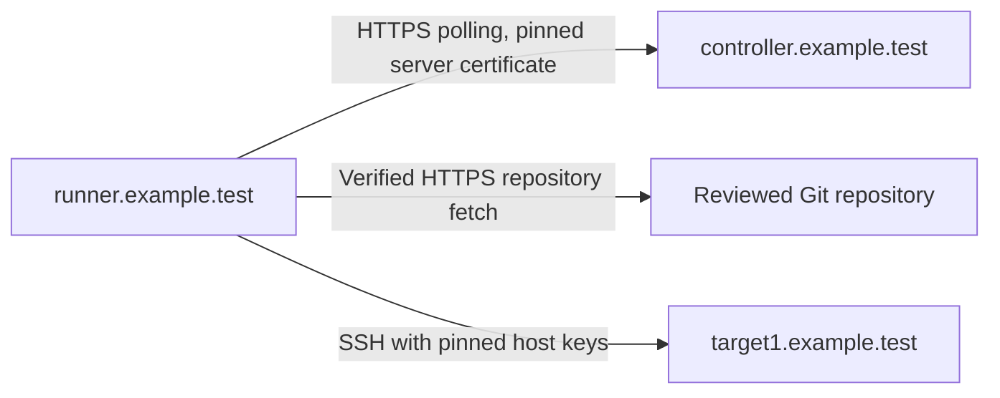

# 18. Run tasks on a separate runner

[Previous: API and integrations](17-api-and-integrations.md) · [Coverage](COMMUNITY-COVERAGE.md) · [Back to the guide](../README.md)

## Goal

Run Ping on a global runner; verify execution location, trust and availability.

| | Edition and evidence |
| --- | --- |
| Edition | Community 2.19.12: global native runners work. |
| Tested with | RHEL 9.8 server; Ubuntu 24.04 amd64 runner and target; Python 3.12; ansible-core 2.21.4. |
| UI or API path | Global **Runners** page; administrator API `/api/runners`; `semaphore runner register` and `start`. |
| Evidence | [September 2026 runner checks](validation/2026-09-community.md#runners). |
| Known limits | Project runners and UI tag routing are paid. Docker/Kubernetes per-task executors are paid and were not tested. CLI unregister is broken in this release. |

## Concept: execution and trust

A runner moves **execution**, not trust. It needs its own Ansible runtime,
dependencies and verified SSH host keys. The repository must be reachable from
the runner; a controller-local folder does not become available there.
Playbooks execute as the runner account and can use the credentials provided
for their tasks. A runner is not an isolation boundary for untrusted playbooks.
The source lets a global runner serve any project; trust its host with all those jobs.



Use a separate `runner.example.test` host. The campaign co-located the runner
on the target for convenience; the recommended separate placement was **not tested**.

## Do: prepare the connection

Prerequisites: a working [chapter 6](06-semaphore.md) task, a fresh Ubuntu 24.04 amd64
runner with admin SSH and a reviewed guide checkout, and a short-lived API
token for a Semaphore **administrator**. Chapter 17's practice token is
deliberately not an administrator's and cannot create runners (403). Signed in
as an administrator, use **API Tokens → New Token** with a short expiry, check
it privately with `GET /api/user` (`"admin": true`) as
[chapter 17](17-api-and-integrations.md) shows, and revoke it after registration.
Take a [recovery capture](10-recovery.md); record the existing `use_remote_runner`,
`runners` and exposure settings for cleanup.

This creates one global runner, an account/unit/configuration, a venv, and three
project objects prefixed **Runner practice**. Reuse the target credentials and
**Practice defaults**. Arrange a quiet window: the switch affects the whole server.

**Where: controller, as root, in the guide checkout.**

Follow [HTTPS browser access](appendices/browser-access.md#https-on-the-vms-address),
including its firewall restrictions, using:

```bash
bash scripts/expose-semaphore.sh --mode https --address controller.example.test
openssl x509 -in /etc/semaphore/tls/semaphore.crt -noout -fingerprint -sha256 -ext subjectAltName
```

The script keeps Semaphore on `127.0.0.1:3000` behind nginx TLS on port 443.
It opens HTTPS in an active host firewall; restrict it to the runner and approved
clients. The campaign confirmed an unrelated host could not connect. Allow runner
access to Git and target SSH too. An existing certificate is reused: confirm
its SAN names `controller.example.test` before continuing.

Through an authenticated transfer, put the controller's public
`/etc/semaphore/tls/semaphore.crt` on the runner as `/tmp/runner-server-ca.pem`.
Also transfer the target's already verified entries from
`/etc/semaphore/known_hosts` as `/tmp/runner-known-hosts`. Include the exact
hostname used by the new inventory. Verify host fingerprints through the
target's console as in [chapter 4](04-access.md); an unverified scan is not a pin.

## Do: install the runtime

**Where: runner, as root, in the reviewed guide checkout.**

Use the controller's Community binary and pinned requirements on a fresh runner
with none of the exercise paths in use. The parentheses run the block in a
subshell that stops at the first failure, such as a checksum mismatch, without
closing your root shell.

```bash
(
set -euo pipefail
apt-get update
apt-get install -y python3.12 python3.12-venv git curl tar openssh-client ca-certificates
runner_download=$(mktemp -d)
runner_archive=semaphore_community_2.19.12_linux_amd64.tar.gz
curl -fL --retry 3 -o "$runner_download/$runner_archive" \
  "https://github.com/semaphoreui/semaphore/releases/download/v2.19.12/$runner_archive"
printf '%s  %s\n' \
  2576f8a473c5e91bd0d7833976111c56f0ad43720210f9ca437037d10acd97cc \
  "$runner_download/$runner_archive" | sha256sum --check
tar -xzf "$runner_download/$runner_archive" -C "$runner_download" semaphore
install -m 0755 "$runner_download/semaphore" /usr/local/bin/semaphore
rm -r -- "$runner_download"
install -d -m 0755 /opt/semaphore-runner
python3.12 -m venv /opt/semaphore-runner/venv
/opt/semaphore-runner/venv/bin/pip install --requirement requirements-controller.txt
chmod -R go+rX /opt/semaphore-runner/venv
semaphore version
/opt/semaphore-runner/venv/bin/ansible-playbook --version
)
```

Confirm Semaphore 2.19.12 matches the server and Ansible reports core 2.21.4;
the campaign verified both. Install additional playbook dependencies here too.

```bash
useradd --system --create-home --home-dir /var/lib/semaphore-runner \
  --shell /usr/sbin/nologin semaphore-runner
install -d -o semaphore-runner -g semaphore-runner -m 0700 \
  /var/lib/semaphore-runner /var/lib/semaphore-runner/tmp
install -d -o root -g semaphore-runner -m 0750 /etc/semaphore-runner
install -o semaphore-runner -g semaphore-runner -m 0600 /dev/null \
  /var/lib/semaphore-runner/runner.token
install -o root -g semaphore-runner -m 0644 /tmp/runner-server-ca.pem /etc/semaphore-runner/server-ca.pem
install -o root -g semaphore-runner -m 0640 /tmp/runner-known-hosts /etc/semaphore-runner/known_hosts
rm /tmp/runner-server-ca.pem /tmp/runner-known-hosts
```

## Do: configure the runner

**Where: runner, as root.** Create `/etc/semaphore-runner/config.json` with:

```json
{
  "web_host": "https://controller.example.test",
  "tmp_path": "/var/lib/semaphore-runner/tmp",
  "home_dir_mode": "user_home",
  "git_client": "cmd_git",
  "env_vars": {
    "PATH": "/opt/semaphore-runner/venv/bin:/usr/local/bin:/usr/bin:/bin",
    "ANSIBLE_HOST_KEY_CHECKING": "True",
    "ANSIBLE_SSH_ARGS": "-o UserKnownHostsFile=/etc/semaphore-runner/known_hosts -o StrictHostKeyChecking=yes"
  },
  "runner": {
    "name": "Runner practice",
    "token_file": "/var/lib/semaphore-runner/runner.token",
    "max_parallel_tasks": 1,
    "connection": {
      "server_ca_cert_file": "/etc/semaphore-runner/server-ca.pem"
    }
  }
}
```

Install the [runner unit](../templates/semaphore-runner.service) from the guide checkout.
Its process `PATH` must name the venv first to find `ansible-playbook`. It retains
the controller's hardening, allowing persistent writes only under the runner home.

```bash
chown root:semaphore-runner /etc/semaphore-runner/config.json
chmod 0640 /etc/semaphore-runner/config.json
install -m 0644 templates/semaphore-runner.service /etc/systemd/system/semaphore-runner.service
systemctl daemon-reload
runuser -u semaphore-runner -- test -r /etc/semaphore-runner/server-ca.pem
runuser -u semaphore-runner -- test -r /etc/semaphore-runner/known_hosts
runuser -u semaphore-runner -- curl --fail --silent --show-error \
  --cacert /etc/semaphore-runner/server-ca.pem https://controller.example.test/api/ping
```

Run `openssl x509 -in /etc/semaphore-runner/server-ca.pem -noout -fingerprint -sha256`
and compare the fingerprint with the controller's.
The 2.19.12 source uses this readable PEM as the runner client's trust roots,
replacing system roots for that client. **An unreadable CA file silently falls
back to system trust.** The live probe refused the self-signed server with an
unknown-authority error, not a file-permission error. Check readability as the
service account first; keep TLS verification enabled.

## Do: register once

**Where: runner, as root, in a private shell with tracing off.**
The tested API created an unregistered global runner, then issued a one-time
`smrs_` token. Its SHA-256 hash was stored server-side with a one-hour expiry;
registration consumed it and replay returned 400. The resulting long-lived
credential goes into the pre-created mode-0600 token file.

Enter your API token privately; the protected response goes directly to
registration. The block runs in a subshell that stops at the first failure:

```bash
set +x
(
set -euo pipefail
umask 077
runner_api_dir=$(mktemp -d)
trap 'rm -rf -- "$runner_api_dir"' EXIT
read -rs -p 'Administrator API token: ' RUNNER_ADMIN_TOKEN; printf '\n'
printf 'header = "Authorization: Bearer %s"\n' "$RUNNER_ADMIN_TOKEN" > "$runner_api_dir/curl.conf"
unset RUNNER_ADMIN_TOKEN
runner_api=https://controller.example.test/api
curl --fail --silent --show-error --config "$runner_api_dir/curl.conf" \
  --cacert /etc/semaphore-runner/server-ca.pem -H 'Content-Type: application/json' \
  --data '{"name":"Runner practice","registered":false,"active":true,"is_default":true,"max_parallel_tasks":1,"webhook":"","tags":[]}' \
  "$runner_api/runners" > "$runner_api_dir/runner.json"
RUNNER_ID=$(python3 -c 'import json,sys; print(json.load(open(sys.argv[1]))["id"])' "$runner_api_dir/runner.json")
printf 'Record this runner ID for cleanup: %s\n' "$RUNNER_ID"
curl --fail --silent --show-error --config "$runner_api_dir/curl.conf" \
  --cacert /etc/semaphore-runner/server-ca.pem -X POST \
  "$runner_api/runners/$RUNNER_ID/registration-token" > "$runner_api_dir/registration.json"
cd /var/lib/semaphore-runner
python3 -c 'import json,sys; print(json.load(open(sys.argv[1]))["registration_token"])' \
  "$runner_api_dir/registration.json" | runuser -u semaphore-runner -- \
  semaphore runner register --stdin-registration-token --config /etc/semaphore-runner/config.json
rm -r -- "$runner_api_dir"
stat -c '%U:%G %a' /var/lib/semaphore-runner/runner.token
systemctl enable --now semaphore-runner
journalctl -u semaphore-runner --since '5 minutes ago' --no-pager
)
```

Expect `semaphore-runner:semaphore-runner 600`. The journal can show
`Runner connected` a few seconds after the block ends; the rehearsal saw the
runner **Online** within ten seconds. If the block stops early, its temporary
directory is removed automatically; investigate the printed error before
running it again. Revoke the temporary administrator token when finished.

**Where: browser, as a Semaphore administrator.** Open the account menu →
**Runners**; confirm **Runner practice** becomes **Online**. Registration alone
left it **Offline** until the service started. **Enabled** (API `active`) permits
dispatch; **Is default** (`is_default`) makes it eligible for untagged tasks.

The flat server setting `runner_registration_token` is weaker: a reusable shared
credential with no one-time consumption or per-runner expiry. Possession allows
further registrations until it changes. The tested default registration created
an inactive, non-default runner. Prefer the one-time flow above.

## Do: prepare and dispatch Ping

**Where: browser, in Ansible Practice, as a project owner.**

Use the [chapter 6 forms](06-semaphore.md) to create these exercise objects:

| Object | Settings |
| --- | --- |
| **Runner practice repository** | **Repositories → New Repository**; the guide's public HTTPS Git URL; reviewed tag `v1.2.0`; Access Key **None**. |
| **Runner practice inventory** | **Inventory → New Inventory → Ansible Inventory**; **Static**; text below; existing target SSH and sudo credentials. |
| **Runner practice Ping** | **Task Templates → New template → Ansible Playbook**; the two objects above; `playbooks/ping.yml`; **Practice defaults**; **Limit → Add limit**: `runner-target`. |

```ini
[lab]
runner-target ansible_host=target1.example.test ansible_user=svc_ansible ansible_python_interpreter=/usr/bin/python3
```

The campaign used a reachable HTTPS repository and Static inventory. Its seeded
controller-local repository failed on the runner with `stat /opt/ansible-lab:
no such file or directory`. Check every other template before the global switch,
including any file inventory, Vault file or dependency paths.

**Where: controller, as root.** Merge these top-level fields into the existing
`/etc/semaphore/config.json`; keep the database, encryption and other settings.
These are the campaign's short observation timeouts, not required defaults:

```json
{
  "use_remote_runner": true,
  "runners": {
    "offline_timeout_sec": 20,
    "task_fail_timeout_sec": 600,
    "reconcile_interval_sec": 10
  }
}
```

Validate the JSON, then run `systemctl restart semaphore`. `use_remote_runner`
sends tasks to runners server-wide. The separate `runners` block controls
liveness/reconciliation. Source defaults are 120/420/30 seconds respectively;
`task_fail_timeout_sec` is not a deadline for an unassigned waiting task.

## Check: execution and availability

**Where: browser, in Ansible Practice, as a project owner.** Run **Runner practice
Ping**. Read the full target recap and runner-assignment message; record the task ID.

**Where: runner, as root.** Run `journalctl -u semaphore-runner --since '5
minutes ago' --no-pager`. Match that task ID with `Task started` and `Task
finished`.

**Where: target, as root.** Check its SSH journal independently for the runner's
connection.

The campaign blocked controller-to-target SSH: the local task failed, then the
runner task succeeded with no unreachable or failed hosts. Runner journal entries,
its checkout and the target SSH log established location; an online badge cannot.

| Condition tested with one eligible runner | Observed result |
| --- | --- |
| Enabled and online | Ping ran on that runner. |
| Enabled, registered and default, but offline | Task stayed `waiting` throughout a 30-second observation, then succeeded after the runner restarted; no controller fallback. |
| Only runner disabled | New task failed immediately: `Failed to run task: no runners available`. |

**Where: runner, as root.** In the quiet window, run `systemctl stop semaphore-runner`.

**Where: browser, as a project owner and Semaphore administrator.** Wait for
**Offline**, then launch one Ping and observe it waiting.

**Where: runner, as root.** Run `systemctl start semaphore-runner`.

**Where: browser, as a project owner.** Verify that same task completes. Runner
loss during execution, failover and exactly-once execution were **not tested**.

## Do: remove the exercise

**Where: browser, as a Semaphore administrator and project owner.** Finish or
stop the exercise's waiting/running tasks. Delete only **Runner practice Ping**,
its inventory and its repository; retain the reused credentials and variables.

**Where: controller, as root.** Restore the recorded `use_remote_runner` and
`runners` settings, preserving other configuration, then restart `semaphore`.

**Where: browser, as a Semaphore administrator.** Delete **Runner practice** on
the global **Runners** page. The tested API equivalent is
`DELETE /api/runners/RUNNER_ID`; check that a subsequent GET returns 404.
Do not rely on `semaphore runner unregister` in 2.19.12: it omitted the runner
authentication header, received 401 and panicked. Server-side deletion also
made the old runner credential unusable in the campaign.

**Where: runner, as root.** Stop and disable the service:

```bash
systemctl disable --now semaphore-runner
rm /etc/systemd/system/semaphore-runner.service
systemctl daemon-reload
rm /var/lib/semaphore-runner/runner.token
```

If retiring the dedicated host, remove only this exercise's configuration,
working files, venv, account and binary. The campaign left those for lab rollback.

**Where: controller, as root.** If HTTPS was only for this exercise, follow
[return to loopback](appendices/browser-access.md#return-to-loopback) and remove its
added firewall permissions. Verify a controller Ping again. Retain runtime and
trust details for recovery; runner restore/re-registration was **not tested** here.
